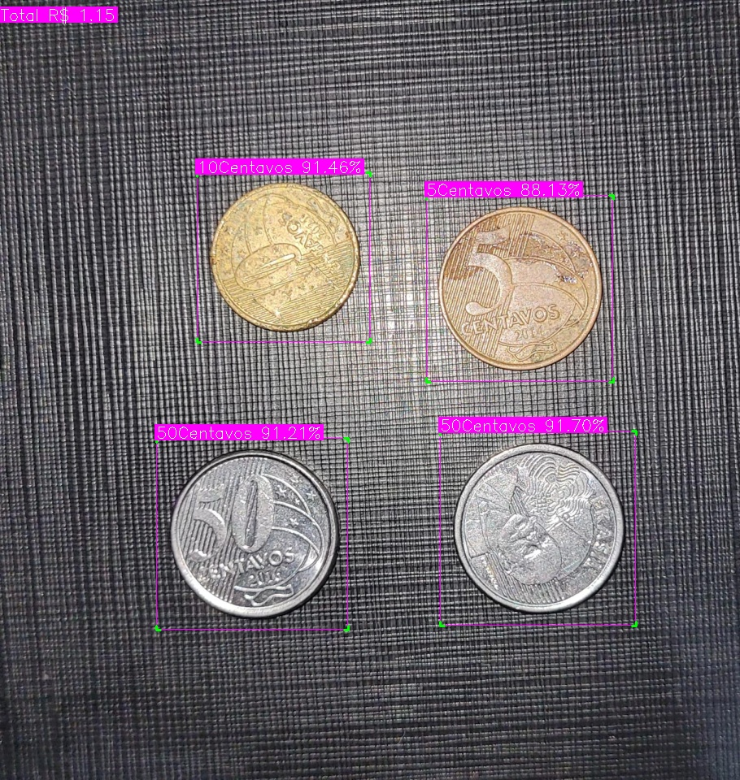

# BRL Coin Counter

This program is a sample of computer vision used to count BRL coins.

The main goal of this project is to practice some core concepts of computer vision using the most popular libraries availables.

It can be divided into three main parts:

- Labelling all the dataset;
- Training the model;
- Predict an input image.

Roboflow was chosen as main platform for labelling images.
It was used a public repository of BRL coins, originally developed by [Bruno Brant](https://universe.roboflow.com/bruno-brant/brazilian-coins-r2vwk).
The base model for this task was the [YOLOv8s](https://docs.ultralytics.com/models/yolov8/#performance-metrics) by ultralytics.

As results, we can see the all the predictions identified by its name and confidence level. At the top left we can see the total amount

The training process was completed using YOLOv8.2.28, Python-3.10.12 and torch-2.3.0+cu121 in a Tesla T4, 15102MiB GPU and took about 8,46 minutes.

- 879 images for training
- 73 imgaes for validation
- 20 epochs
- learning rate of 0.01
